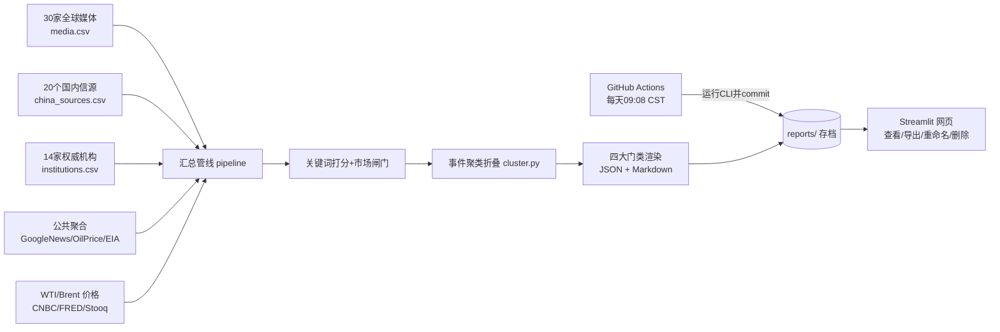

# 原油观察日报（oil-watch）

聚合 **全球 30 家主流媒体 + 21 个中国国内政经信源 + 14 家权威机构 + 公共聚合信源**（全部免费、无需任何 Token），自动筛选可能影响**原油价格**的全部信息——能源市场、战争与地缘、宏观经济、政治政策四大门类；**同一事件的多家报道自动聚类折叠，点击展开**。每天 **09:08（北京时间）** 形成分类报告并长期存档，网页端支持查看、**导出到本地、重命名、删除**。通过 GitHub Actions 部署到 Streamlit Community Cloud。

## 信源与门类

| 信源层 | 数量 | 接入方式 | 内容 |
|---|---|---|---|
| 全球 Top30 媒体 | 30 启用 + 15 备选（`data/media.csv`） | 官方免费 RSS | BBC/NYT/CNN/卫报/AP/华盛顿邮报/路透/半岛电视台/彭博/CNBC/FT/WSJ/经济学人 等 |
| 中国国内信源 | 21（`data/china_sources.csv`） | 3 家官方 RSS 直连 + 18 个 GN 站内备份 | 中新网、界面、CGTN（直连，实测实时）；人民网、新华网、新浪、财新/一财/华尔街见闻/澎湃/观察者/每经/证券时报；中国政府网/发改委/能源局/央行/商务部/外交部/海关总署/统计局 |
| 权威机构 | 14（`data/institutions.csv`） | 官方 RSS + GN 备份 | OPEC、IEA、EIA、IMF、世行、美联储、欧央行、日本央行、白宫、国务院、财政部、北约、IAEA、欧盟 |
| 公共聚合骨干 | 7 个主题查询 | Google News + OilPrice + EIA | 中英双语主题检索，全球可达兜底层 |
| 价格 | WTI / Brent | CNBC→FRED→Stooq 三级兜底 | 免 key |

完整清单见 `data/信源列表.md`。

**国内信源接入说明（如实告知）**
- **官方 RSS 直连**（中新网/界面/CGTN）已逐一实测为实时更新，大陆网络与云端均可达。人民网、新华网、新浪的官方 RSS 经实测已停更（分别停在 2025-06、2022、2018），故不采用直连。
- 停更官方源、无稳定公开 RSS 的财经媒体（财新/一财/华尔街见闻等）以及主要政府部门，使用 **Google News 站内检索**（如 `site:gov.cn 能源`）作为备份：GitHub Actions 与 Streamlit 云端（美国机房）可达；若在中国大陆本地直连运行，这些备份会失败并被**逐源跳过**，不影响官方直连行与整体出报。

**四大门类（报告按此分节）**：A 能源市场（核心油价/供需/库存/需求/航运/油气产品）、B 战争与地缘（战争冲突/制裁博弈）、C 宏观经济（央行/美元/通胀）、D 政治政策（仅在同时命中油价直接相关组时入选，纯政治噪音剔除）。

**去重折叠**：先按标题精确去重，再用「拉丁词干 + 中文二元组」相似度做事件聚类；日期/数值不一致、涨跌方向相反的不会误并。每组只展示分值最高的主报道，其余收进 `<details>` 折叠块（Streamlit/GitHub/编辑器均可点击展开）。

## 架构与数据流



- **定时**：GitHub Actions cron `8 1 * * *` UTC = **北京时间 09:08**（错峰 08 分避免整点排队），生成后自动 commit，长期不丢。
- **逐源容错**：任一 RSS 失败只记录状态、不影响整体；报告末尾列出可用率与失败原因。

## 目录结构

```
oil-watch/
├── app.py                     # Streamlit 前端（4个Tab）
├── requirements.txt
├── data/
│   ├── media.csv              # 30家top媒体 + 15家备选
│   ├── china_sources.csv      # 21个中国国内信源（3直连+18 GN备份）
│   ├── institutions.csv       # 14家权威机构
│   └── 信源列表.md
├── oilwatch/
│   ├── config.py              # .env/环境变量入口
│   ├── keywords.py            # 10个关键词组 → 4大门类
│   ├── filter.py              # 相关性打分与市场闸门
│   ├── cluster.py             # 同事件聚类折叠（中英混合）
│   ├── prices.py              # WTI/Brent 三级兜底
│   ├── pipeline.py            # 多源编排（各源独立开关）
│   ├── report.py              # 门类分节 + details 折叠渲染
│   ├── storage.py             # 存档/重命名/删除/导出ZIP
│   ├── cli.py                 # daily/sources/list
│   └── sources/
│       ├── media_feeds.py     # 三份 CSV 的并发抓取
│       └── public_feeds.py    # 聚合骨干
├── reports/
├── .github/workflows/daily_report.yml
└── tests/                     # 15 个单元测试
```

## 一、本地运行

```bash
cd oil-watch
python -m venv .venv && source .venv/bin/activate
pip install -r requirements.txt
python -m oilwatch.cli daily       # 生成日报（全部信源免费、无需 key）
python -m oilwatch.cli sources     # 查看三类信源清单与启用状态
python -m oilwatch.cli list        # 查看存档
streamlit run app.py               # 打开网页
```

CLI 开关：`--no-media --no-china --no-institutions --no-feeds --no-prices`，
另可 `--window-hours 24 --min-score 5`（默认阈值 5）。

## 二、部署到 GitHub + Streamlit

```bash
git init && git add . && git commit -m "init oil-watch"
git branch -M main
git remote add origin https://github.com/<你的用户名>/oil-watch.git
git push -u origin main
```

1. **Actions** 页确认 workflow 启用；可先 **Run workflow** 手动跑一次。
2. [share.streamlit.io](https://share.streamlit.io/) → Deploy → 选仓库、分支 main、入口 `app.py`。
3. 之后每天 09:08（北京时间）自动出报告；网页左侧可随时手动生成。

> 改时间/时区：workflow cron 与 `REPORT_TZ` 两处同步改（如日本 09:08 = `8 0 * * *` + `Asia/Tokyo`）。

## 三、报告的查看、导出、重命名、删除

网页「🗄 报告档案」页：选中报告即在页面内显示全文；底部折叠区可单份导出 `.md`/`.json`/`.zip`、一键导出全部 ZIP、重命名（同步文件名与标题）、删除（二次确认）。

**持久化说明**：Actions 每天把报告 commit 进 Git（权威长期存档）；Streamlit Cloud 容器重启会重置本地磁盘，网页端改名/删除在重新部署后以 Git 版本为准，重要整理后请导出 ZIP 本地留档；要让删除永久生效，本地 `git rm reports/对应文件` 后推送。

## 四、自定义

- **增删信源**：编辑 `data/` 下三份 CSV（`enabled` 列 1/0；`feeds` 分号分隔多栏目）。备选 15 家海外媒体默认关闭，改 1 即启用。
- **关键词/阈值**：编辑 `oilwatch/keywords.py`；网页左侧滑块调阈值。
- **折叠松紧**：`pipeline.run(dup_threshold=0.5)`，调高更严格（更少折叠）、调低更激进。
- **聚合骨干**：`oilwatch/sources/public_feeds.py`。

## 五、测试

```bash
python -m unittest discover -s tests -v   # 过滤/门类/聚类防误并/清单 共15例
```

## 免责声明

本工具仅做信息聚合与研究辅助，不构成任何投资建议。抓取请遵守各信源的服务条款与速率限制。
